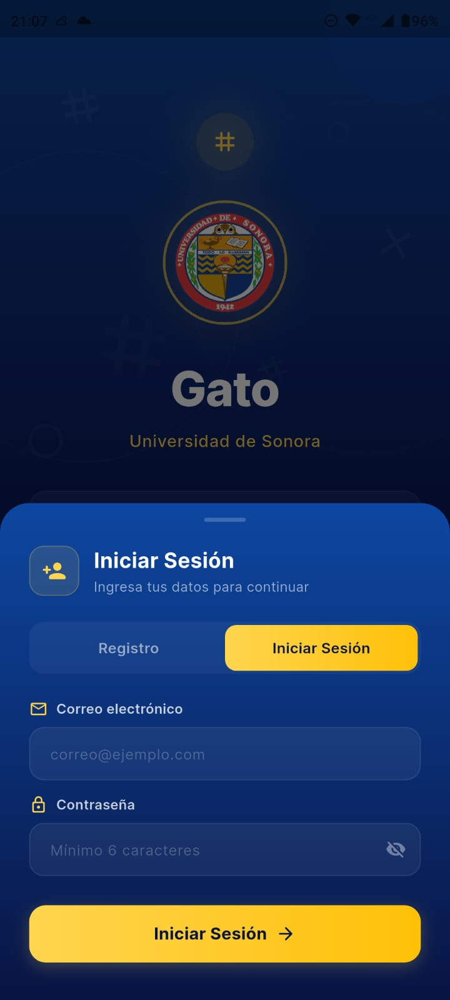
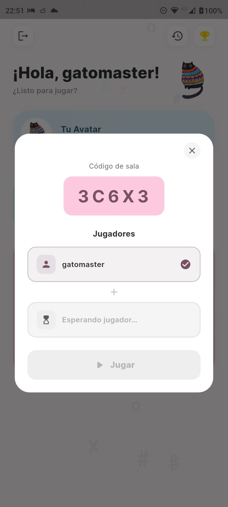
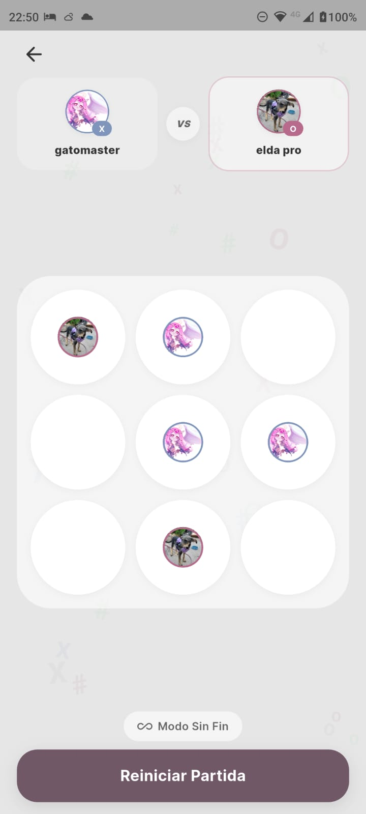
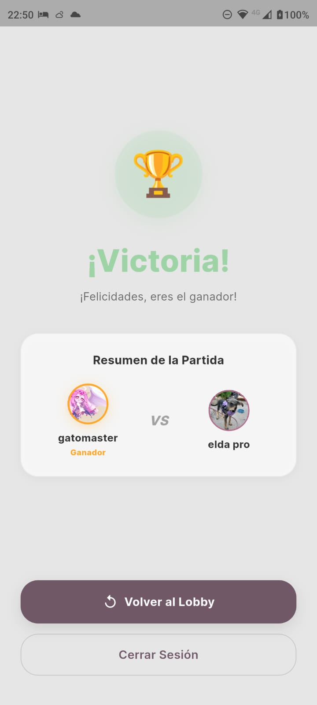
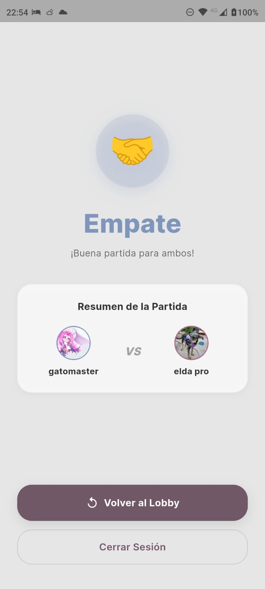
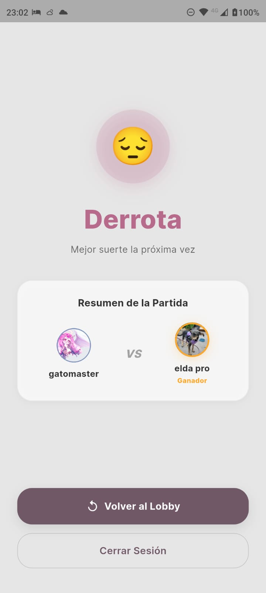
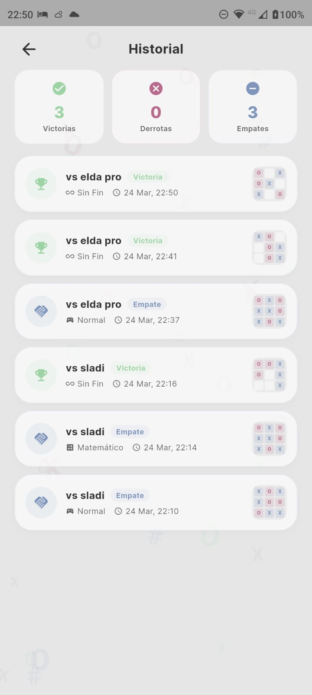
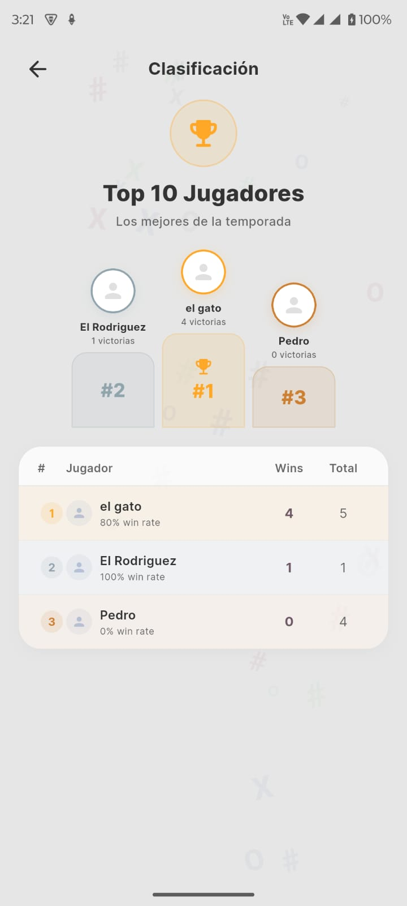

# tictactoe

# app_pds

Aplicación desarrollada en Flutter que permite jugar Tic Tac Toe en línea en tiempo real con hasta tres modos de juego.
Desarrollada para la materia de Practicas de Desarrollo de Sistemas III (Programacion Movil)

Caracteristicas:

- Juego en línea en tiempo real (multiplayer con Firebase)
- Creación y unión a salas mediante código
- Modo normal (clásico)
- Modo infinito (las fichas desaparecen dinámicamente)
- Modo matemático (resulve para jugar)
- Sistema de autenticación (login y registro)
- Foto de perfil como ficha
- Historil de partidas
- Leaderboard dinámico (ranking de jugadores)

Tecnologias:

- Flutter Flutter 3.41.0 • channel stable • https://github.com/flutter/flutter.git
- Tools • Dart 3.11.0 • DevTools 2.54.1
- Cloud Firestore
- Firebase Storage

  
Imagenes:

  
  
  
  

  
  
  

  
  

